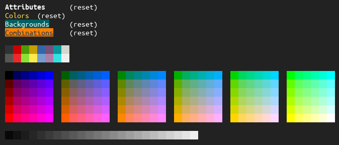

ANSI escape-code library for Golang.
[](https://godoc.org/github.com/makyo/ansigo)

[](demo.png)

```go
package main

import (
	"fmt"

	a "github.com/makyo/ansigo"
)

func main() {
	fmt.Print("\n")
	fmt.Printf(
		"%s\t(reset)\n%s\t(reset)\n%s\t(reset)\n%s\t(reset)\n\n",
		a.MaybeApplyOne("bold", "Attributes"),
		a.MaybeApply("brightyellow", "Colors"),
		a.MaybeApply("DeepSkyBlue4:bg", "Backgrounds"),
		a.MaybeApply("#123456+rgb(255, 127, 0):bg+underline", "Combinations"))

	for i := 0; i < 256; i++ {
		fmt.Print(a.MaybeApplyOne(fmt.Sprintf("%d:bg", i), "  "))
		if i == 7 || i == 15 {
			fmt.Print("\n")
		}

		if i > 15 && i < 232 && (i-15)%6 == 0 {
			fmt.Print("  ")
			if (i-15)%36 == 0 {
				fmt.Print("\n")
			}
		}

		if i == 15 || i == 231 {
			fmt.Print("\n")
		}
	}
	fmt.Print("\n")
}
```

[](https://patreon.com/makyo)
[](https://ko-fi.com/drabmakyo)
[](https://liberapay.com/makyo)
